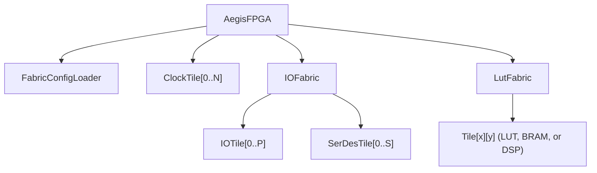

# Aegis Architecture Overview

Aegis is a parameterized FPGA fabric generator written in Dart using the
ROHD hardware description framework. It outputs synthesizable SystemVerilog
for the entire FPGA, from logic tiles to I/O pads to the configuration
chain. This document describes the silicon architecture: how the fabric is
structured, how tiles connect, and how a bitstream programs the device.

## Device Hierarchy

An Aegis device is organized as a layered hierarchy:

The `LutFabric` is a rectangular grid of tiles. Each tile contains a
configurable logic block (CLB) and a routing switchbox. Specialized columns
replace standard LUT tiles with BRAM or DSP tiles at regular intervals.

The `IOFabric` wraps the grid perimeter with I/O pads and SerDes
transceivers. Clock tiles sit outside the fabric and distribute divided
clocks to all tiles.

## Fabric Grid Layout

The grid is `width x height` tiles. Columns are specialized based on
their index:

- **BRAM columns**: placed at every `bramColumnInterval` columns
- **DSP columns**: placed at every `dspColumnInterval` columns, skipping
  BRAM positions
- **LUT columns**: all remaining columns

For the Terra 1 device (48x64, bramColumnInterval=16, dspColumnInterval=24):

| Column Type | Count | Tiles per Column | Total Tiles |
|-------------|-------|------------------|-------------|
| LUT         | 45    | 64               | 2,880       |
| BRAM        | 2     | 64               | 128         |
| DSP         | 1     | 64               | 64          |

## Carry Chains

Each column has a vertical carry chain running south to north. The bottom
tile in each column receives `carryIn = 0`, and each tile's `carryOut`
feeds the `carryIn` of the tile above it. This enables fast arithmetic
(adders, counters) without routing through the switchbox.

BRAM tiles pass the carry signal through unchanged.

## Edge I/O

The fabric's four edges aggregate tile outputs using wired-OR. Any tile
on an edge can drive the corresponding external output. I/O pads on the
perimeter connect to these edge signals:

- North edge: `width` pads (left to right)
- East edge: `height` pads (top to bottom)
- South edge: `width` pads (left to right)
- West edge: `height` pads (top to bottom)

Total pads = `2 * width + 2 * height` (224 for Terra 1).

## Configuration

The entire device is programmed through a single serial shift register
chain. Bits are shifted in through the clock tiles, then through I/O
tiles, then SerDes tiles, and finally through the fabric tiles in
row-major order. A `cfgLoad` pulse transfers the shift register contents
to the active configuration registers in parallel.

See [Configuration Chain](configuration.md) for the full protocol.

## Tile Documentation

- [CLB (Configurable Logic Block)](clb.md)
- [Routing](routing.md)
- [BRAM (Block RAM)](bram.md)
- [DSP (Digital Signal Processing)](dsp.md)
- [I/O Pad](io.md)
- [SerDes](serdes.md)
- [Clock Tile](clock.md)
- [Configuration Chain](configuration.md)

## Other Documentation

- [PDK Integration and Tapeout](pdk.md)
