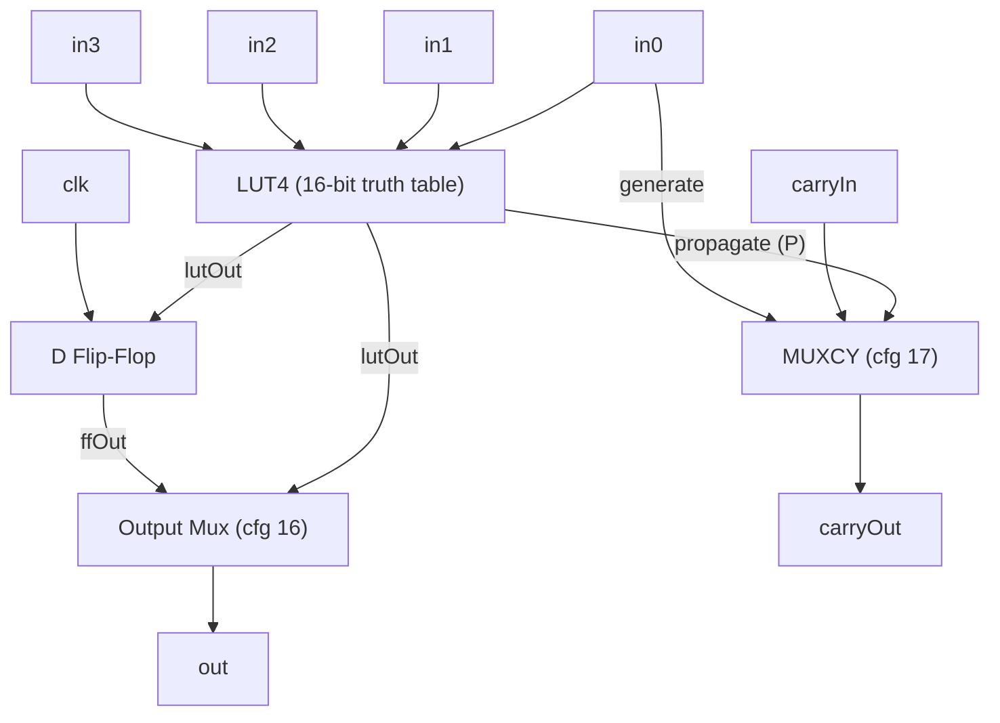

# Configurable Logic Block (CLB)

The CLB is the fundamental logic element of the Aegis fabric. Each CLB
contains a 4-input lookup table (LUT4), a D flip-flop, and a carry chain
multiplexer (MUXCY). Together these implement arbitrary 4-input
combinational logic with optional registering and fast arithmetic.

## Block Diagram

## LUT4

The LUT4 implements any Boolean function of four inputs. It stores a
16-bit truth table in configuration bits `[15:0]`. The output is selected
by using the four inputs as an index into the truth table.

Internally, the LUT is a 4-stage multiplexer tree:

| Stage | Select | Muxes | Operation                              |
|-------|--------|-------|----------------------------------------|
| 0     | in0    | 8     | `s0[i] = mux(in0, cfg[2i+1], cfg[2i])` |
| 1     | in1    | 4     | `s1[i] = mux(in1, s0[2i+1], s0[2i])`   |
| 2     | in2    | 2     | `s2[i] = mux(in2, s1[2i+1], s1[2i])`   |
| 3     | in3    | 1     | `out = mux(in3, s2[1], s2[0])`         |

The effective computation is `out = cfg[{in3, in2, in1, in0}]`.

### Common Truth Tables

| Function     | Truth Table | Notes                        |
|--------------|-------------|------------------------------|
| 2-input AND  | `0x8888`    | on in0, in1                  |
| 2-input OR   | `0xEEEE`    | on in0, in1                  |
| 2-input XOR  | `0x6666`    | also used as carry propagate |
| NOT          | `0x5555`    | inverts in0                  |
| Constant 0   | `0x0000`    |                              |
| Constant 1   | `0xFFFF`    |                              |

## D Flip-Flop

The flip-flop captures the LUT output on the rising clock edge. Config
bit `[16]` selects whether the CLB output comes from the flip-flop
(registered) or directly from the LUT (combinational).

- `cfg[16] = 0`: `out = LUT output` (combinational)
- `cfg[16] = 1`: `out = FF output` (registered)

## Carry Chain (MUXCY)

The carry chain enables fast arithmetic by bypassing the general routing
fabric. When carry mode is enabled (config bit `[17] = 1`):

- The LUT output acts as the **propagate** signal (P)
- `carryOut = P ? carryIn : in0`
- `sum = P ^ carryIn` (fast XOR for adder sum bit)

When carry mode is disabled (`cfg[17] = 0`):
- `carryOut = 0`
- The CLB output is the normal LUT/FF output

Carry chains propagate vertically through a column (south to north),
enabling multi-bit adders and counters without consuming routing
resources.

## Configuration Bit Layout

| Bits     | Width | Field       |
|----------|-------|-------------|
| `[15:0]` | 16    | LUT truth table |
| `[16]`   | 1     | FF enable (1 = registered) |
| `[17]`   | 1     | Carry mode enable |

**Total: 18 bits**
