# Configuration Chain

The Aegis FPGA is programmed by shifting a bitstream through a single
serial chain that passes through every tile in the device. This document
describes the chain topology, the shift register protocol, and the
bitstream loading process.

## Chain Topology

The configuration chain is a single serial path. Bits enter at the first
clock tile and shift through every configurable tile in the device in
this order:

1. **Clock tiles** (first)
2. **I/O tiles** (perimeter pads)
3. **SerDes tiles**
4. **Fabric tiles** (row-major: row 0 left to right, then row 1, etc.)

Each tile's `cfgOut` connects to the next tile's `cfgIn`, forming a
continuous shift register across the entire device.

```mermaid
graph LR
    cfgIn --> C0["ClockTile[0]"] --> CN["ClockTile[N]"]
    CN --> IO0["IOTile[0]"] --> IOP["IOTile[P]"]
    IOP --> S0["SerDes[0]"] --> SS["SerDes[S]"]
    SS --> T00["Tile[0,0]"] --> T10["Tile[1,0]"] --> TW0["Tile[W-1,0]"]
    TW0 --> T01["Tile[0,1]"] --> TWH["Tile[W-1,H-1]"] --> cfgOut
```



## Per-Tile Shift Register

Every tile (regardless of type) uses the same shift register mechanism:

1. **Shift register** (`shiftReg`): on each clock edge, bits shift in
   from `cfgIn` at the MSB and shift out from bit 0 to `cfgOut`.

   ```
   shiftReg <= {cfgIn, shiftReg[configWidth-1 : 1]}
   cfgOut   <= shiftReg[0]
   ```

2. **Config register** (`configReg`): a parallel-load register that holds
   the active configuration. It only updates when `cfgLoad` is asserted:

   ```
   if (cfgLoad) configReg <= shiftReg
   ```

All tile logic reads from `configReg`, not from the shift register. This
means the tile's behavior does not change during shifting; it only updates
on the `cfgLoad` pulse.

## Bitstream Loading Protocol

The `FabricConfigLoader` module manages the loading process:

### Phase 1: Memory Read

The loader reads configuration words sequentially from an external memory
interface (`DataPortInterface`). It increments the word address each cycle
until all required words have been fetched.

### Phase 2: Deserialization

Read words are collected into a wide register. Once enough data has been
fetched, the loader flattens the words into a single bit array.

### Phase 3: Serial Shift

The loader shifts out one bit per clock cycle into the fabric's `cfgIn`
line. A bit counter tracks progress through the full bitstream.

### Phase 4: Load Pulse

After all bits have been shifted in, the loader pulses `cfgLoad`. All
tiles simultaneously transfer their shift register contents to their
config registers. The loader then asserts `done`.

## Total Configuration Bits

The total bitstream size depends on the device parameters:

```
totalBits = (clockTileCount * 49)
          + (totalPads * 8)
          + (serdesCount * 32)
          + fabricConfigBits
```

For Terra 1 (48x64, tracks=4):

| Section      | Count | Bits Each | Total       |
|--------------|-------|-----------|-------------|
| Clock tiles  | 2     | 49        | 98          |
| I/O tiles    | 224   | 8         | 1,792       |
| SerDes tiles | 4     | 32        | 128         |
| LUT tiles    | 2,880 | 102       | 293,760     |
| BRAM tiles   | 128   | 8         | 1,024       |
| DSP tiles    | 64    | 16        | 1,024       |
| **Total**    |       |           | **297,826** |

## Reset Behavior

On power-on reset, both the shift register and config register in every
tile are cleared to zero. In this default state, all logic is disabled:
LUTs output zero, routing is disconnected, and I/O pads are
high-impedance.
