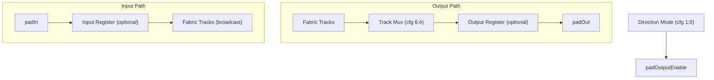

# I/O Tile

I/O tiles sit on the fabric perimeter and connect internal routing tracks
to external pads. Each tile interfaces one pad with the fabric and
supports input, output, bidirectional, and high-impedance modes.

## Block Diagram

## Direction Modes

Config bits `[1:0]` select the pad direction:

| Value | Mode          | Behavior                              |
|-------|---------------|---------------------------------------|
| `00`  | High-Z        | Pad isolated, fabric output is zero   |
| `01`  | Input         | Pad drives fabric, pad output is zero |
| `10`  | Output        | Fabric drives pad, output enable high |
| `11`  | Bidirectional | Both paths active                     |

## Input Path

When in input or bidirectional mode, the pad value is broadcast to all
fabric tracks. An optional input register (config bit `[2]`) adds a
pipeline stage clocked by the fabric clock.

## Output Path

When in output or bidirectional mode, one fabric track is selected by
config bits `[6:4]` (supporting up to 8 tracks). An optional output
register (config bit `[3]`) adds a pipeline stage. The selected value
drives `padOut`, and `padOutputEnable` is asserted.

## Configuration

| Bit      | Field                  |
|----------|------------------------|
| `[1:0]`  | Direction mode         |
| `[2]`    | Input register enable  |
| `[3]`    | Output register enable |
| `[6:4]`  | Output track select    |
| `[7]`    | Reserved (pull-up)     |

**Total: 8 bits**
