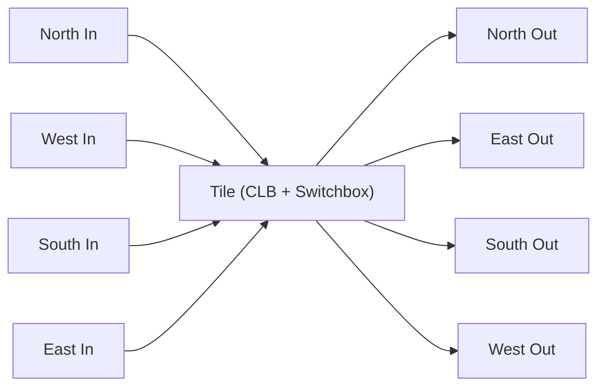

# Routing Architecture

Each tile in the Aegis fabric contains a routing switchbox alongside its
logic element (CLB, BRAM, or DSP). The switchbox connects the tile to its
four neighbors and allows signals to pass through, turn corners, or enter
and exit the logic element.

## Tile Ports

Every tile has four directional ports (north, east, south, west), each
carrying `T` tracks (where `T` is the fabric's track parameter). Signals
flow between adjacent tiles: the north output of tile `(x, y)` connects
to the south input of tile `(x, y-1)`, and so on for each direction.



## Input Multiplexers

Each CLB has four inputs (in0 through in3). Each input is driven by its
own multiplexer that selects from:

- Track 0 through T-1 of each direction (4 * T sources)
- The CLB's own output (feedback)
- Constant 0
- Constant 1

The select width per input is `ceil(log2(4*T + 3))` bits.

For example, with `T = 1` (4 directional tracks + CLB output + 0 + 1 = 7
sources), each input mux needs 3 select bits.

| Select Value | Source       |
|--------------|--------------|
| 0 to T-1     | North tracks |
| T to 2T-1    | East tracks  |
| 2T to 3T-1   | South tracks |
| 3T to 4T-1   | West tracks  |
| 4T           | CLB output   |
| 4T+1         | Constant 0   |
| 4T+2         | Constant 1   |

## Output Multiplexers

Each direction has `T` output tracks, and each track has its own output
multiplexer. The output mux selects from:

- The corresponding track from each of the four directions (pass-through
  or turn)
- The CLB output

Each output track uses 4 config bits:

| Bit     | Function                                      |
|---------|-----------------------------------------------|
| `[0]`   | Enable (0 = drive zero, 1 = drive selected)   |
| `[3:1]` | Source select (0=N, 1=E, 2=S, 3=W, 4=CLB out) |

This per-track output mux design (as opposed to a shared mux per
direction) follows the approach used in architectures like the iCE40 and
ECP5, allowing independent routing of each track.

## Tile Configuration Layout

The full tile config concatenates the CLB config, input mux selects, and
output routing:

| Section         | Bits                   | Width (T=1) |
|-----------------|------------------------|-------------|
| CLB config      | `[17:0]`               | 18          |
| Input mux 0     | `[17 + selW : 18]`     | 3           |
| Input mux 1     | next selW bits         | 3           |
| Input mux 2     | next selW bits         | 3           |
| Input mux 3     | next selW bits         | 3           |
| Output routing  | 4 dirs * T tracks * 4b | 16          |
| **Total**       |                        | **46**      |

For multi-track configurations, the formula is:

```
tileConfigWidth(T) = 18 + 4 * ceil(log2(4*T + 3)) + 4 * T * 4
```

## Inter-Tile Connectivity

### Horizontal

Tiles at `(x, y)` and `(x+1, y)` connect east-to-west. The east output
of `(x, y)` feeds the west input of `(x+1, y)`, and vice versa.

### Vertical

Tiles at `(x, y)` and `(x, y+1)` connect north-to-south. The north
output of `(x, y)` feeds the south input of `(x, y-1)`.

### Edge Aggregation

At the fabric boundary, tile outputs along each edge are combined with
wired-OR. Any tile on the north row can drive the north edge output, and
so on for each edge. This allows edge tiles to communicate with the I/O
perimeter.
